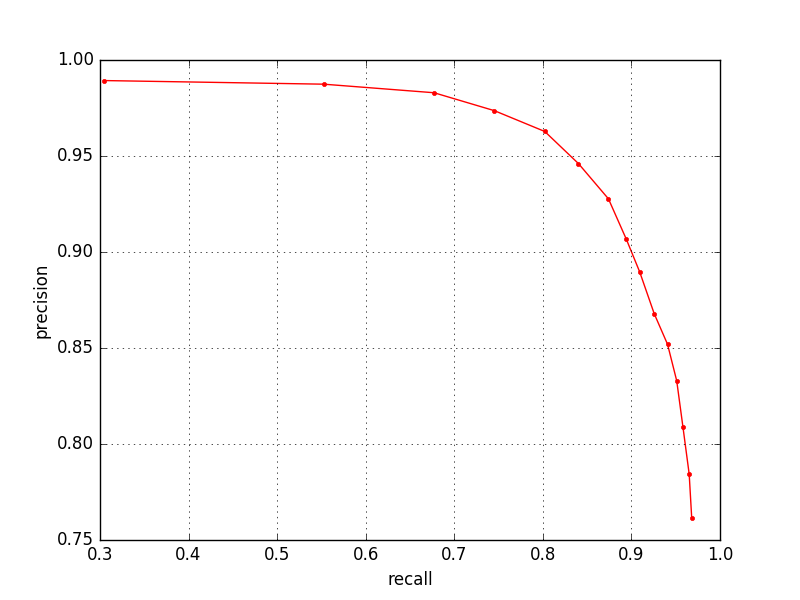

# flyem\_syn\_eval

computes precision-recall curves for synapse prediction.  predicted
and ground-truth synapses can be read from json files or pulled from
DVID.

## installation

install conda via [miniconda or anaconda](https://conda.io/docs/download.html), eg:

```bash
# linux:
wget https://repo.continuum.io/miniconda/Miniconda2-latest-Linux-x86_64.sh
bash Miniconda2-latest-Linux-x86_64.sh
```

install flyem\_syn\_eval and optionally ipython, matplotlib to conda environment with name <NAME>:

```
conda create -n <NAME> -c flyem flyem_syn_eval ipython matplotlib
```

## specifying T-bars

T-bars can be given either as a DVID annotation instance or a json
file following the DVID annotation format:

```python
Tbar_Info(dvid_annotation, dvid_server, dvid_uuid, dvid_roi)
Tbar_Info(json_filename)
```

## example

```python
from flyem_syn_eval import eval
import numpy as np
import matplotlib.pyplot as plt

results = eval.evaluate_pr(
    eval.Tbar_Info('fpl_unet_pred_cx1_2_baseline',
                   'emdata2:8000','cb7dc','roi_cx1_2'),
    eval.cx_synapse_groundtruth('2'),
    conf_thresholds=np.arange(0.7,0.98,0.02))
plt.plot(results.rr, results.pp, 'r.-')
plt.xlabel('recall')
plt.ylabel('precision')
plt.grid()
plt.show()
```

will produce the following plot:

